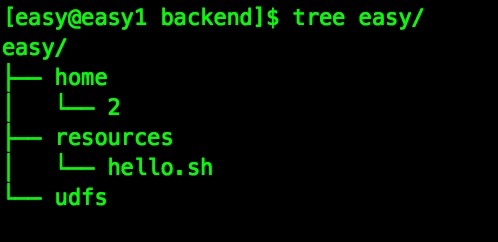
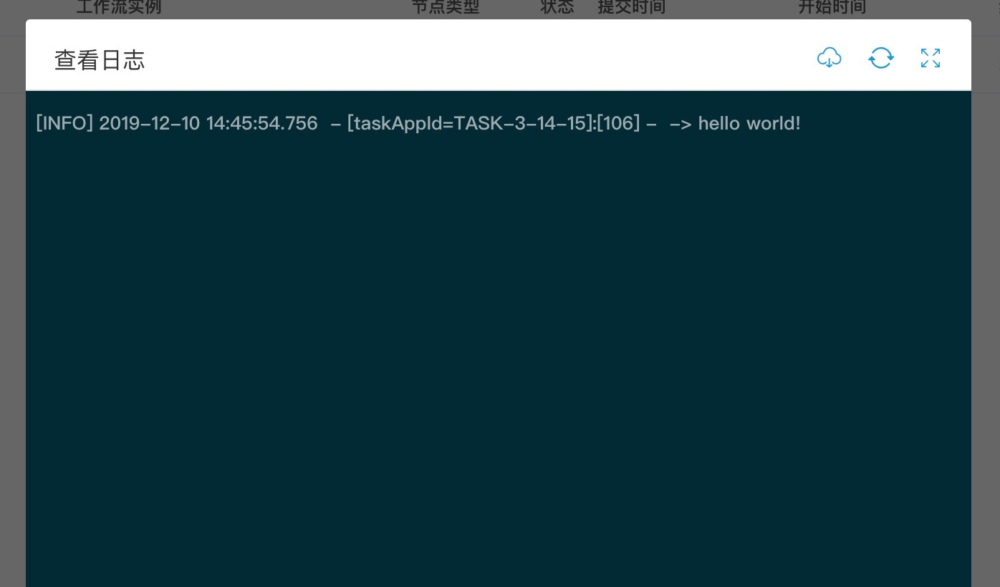

# DolphinScheduler 一把梭！


## 概述

这个项目的想法很简单，基于ansible开发，实现DolphinScheduler方便安装，升级，运维。

基于DolphinScheduler v1.2.0作为起点版本，以后的运维操作都从这个版本开始。（1.2.0以前改动跨度太大，兼容工作量太大了）

构建思路，主要是参考了[tidb-ansible](https://github.com/pingcap/tidb-ansible)项目，前人栽树后人乘凉，谢谢。

`注意：这是一套全新的安装流程，请忘记掉以前的安装步骤，严格按照我说的做！`

该项目主要实现以下操作：
- 安装集群，默认是在线安装，[离线安装](./doc/offline.md)
- 启动、停止集群 [点击打开](./doc/ops.md)
- 远程角色配置修改 [点击打开]()
- 升级集群 或 单独升级某个角色（单独升级某个jar包）
- 扩容缩容集群
- 对接大数据相关组件（敬请期待）
- 自动收集日志，方便集群日志查看（敬请期待）
- 销毁集群（敬请期待）

---

从现在开始往下读，是在讲解怎么从零开始部署DolphinScheduler，以`本地存储`当做资源中心，并测试调度一个shell，抄起键盘，一把梭！搞起来！干！

---

## 基本要求

资源有限，操作系统选择的centos7 python选择的2.7.5，按照道理说只要版本差距不是很大，都可以安装。但是目前我是使用该环境开发，运维的。望谅解。（不建议使用centos6系列，因为没时间和精力去做兼容）

## 安装中可能会遇到的问题

这是我自己安装所遇到的问题，整理了一下供大家参考。[点击打开](./QA.md)

## 准备机器

机器环境，配置最低为CPU：1c MEM：6g（仅供参考）

| ip | 角色 |
| --- | --- |
|192.167.8.131|部署机，jdk，zk，master，api，alert，nginx，db|
|192.167.8.132|jdk，zk，worker|
|192.167.8.133|jdk，zk，worker|

## 在部署机上安装依赖

其实这个`部署机`有很多种叫法，有叫跳板机，堡垒机等等。这个机器看用户怎么安排它在集群中的位置了。

有把它放在集群中的（比如我集群5个节点，5个节点都有彼此的角色，然后部署机在其中一个任务较轻的角色中）。

也有把它放在集群外的（比如我集群有5个节点，有1台配置较低的节点能够连接它们，那么我们可以把部署机放在这台配置较低的节点中）。

执行以下命令安装依赖。

```
yum -y install epel-release git curl sshpass && \
yum -y install python2-pip && \
yum -y install git
```

## 在部署机上创建运维DolphinScheduler用户，并生成 ssh key

用 `root` 登录部署机，执行以下命令。创建 `easy` 用户。

```
useradd easy
```

设置`easy`用户密码。

```
passwd easy
```

配置`easy`用户 sudo 免密，直接执行以下命令。

```
echo 'easy ALL=(ALL) NOPASSWD: ALL' >> /etc/sudoers && \
sed -i 's/^Defaults    requiretty/#Defaults    requiretty/' /etc/sudoers
```

给`easy`用户生成 ssh key

```
su - easy

ssh-keygen -t rsa
```

提示 `Enter passphrase` 时一路回车即可。执行成功后，ssh 私钥文件为 `/home/easy/.ssh/id_rsa`， ssh 公钥文件为 `/home/easy/.ssh/id_rsa.pub`。

## 在部署机中下载ds-yibasuo

用`easy`用户登陆部署机，执行`cd ~`切换到主目录，再执行以下命令获取ds-yibasuo源码。

```
git clone git@github.com:feloxx/ds-yibasuo.git
```

## 在部署机中安装ds-yibasuo和依赖

用`easy`用户登陆部署机，切换到操作目录，一般目录为 /home/easy/ds-yibasuo，执行以下命令安装ansible

```
sudo pip install -r ./requirements.txt && ansible --version
```

看到以下内容则代表ansible安装成功

```
ansible 2.7.12
  config file = None
  configured module search path = [u'/home/easy/.ansible/plugins/modules', u'/usr/share/ansible/plugins/modules']
  ansible python module location = /usr/lib/python2.7/site-packages/ansible
  executable location = /bin/ansible
  python version = 2.7.5 (default, Aug  7 2019, 00:51:29) [GCC 4.8.5 20150623 (Red Hat 4.8.5-39)]
```

## 在部署机中配置与集群的互信及sudo权限

用`easy`用户登陆部署机，切换到操作目录，一般目录为 /home/easy/ds-yibasuo，编辑host.ini文件。

将你需要进行部署的机器ip信息添加其中。

`username`是你用来运维DolphinScheduler的用户，正好咱们就填写刚才所创建的。这里的意思就是告诉ansible，我们使用这个用户来进行所有的运维操作。

```
[servers]
192.167.8.131
192.167.8.132
192.167.8.133

[all:vars]
username = easy
```

执行以下命令，按提示输入部署目标机器 `root` 用户密码。该步骤将在部署目标机器上创建 `easy` 用户，并配置 sudo 规则，配置中控机与部署目标机器之间的 ssh 互信。

```
ansible-playbook -i hosts.ini create_users.yml -u root -k
```

## 操作系统优化配置

敬请期待

## inventory.ini 角色分配

用`easy`用户登陆部署机，切换到操作目录，一般目录为 /home/easy/ds-yibasuo，编辑inventory.ini文件。

大家可以根据自己的需要来分配角色，这是我的供大家参考：

- db，master，logger，api，alert，nginx 共用1个节点
- workder 2个节点
- 如果把所有角色的ip是同一个ip，则为单节点部署，请注意该节点最好有8g内存

需要注意的地方:

- servers需要添加host_ip和host_name，ip与实际ip相对应，host_name可以根据需要自行修改。
- myid，为zk的id，按顺序添加。

```
## DolphinScheduler Part
[servers]
192.167.8.131 host_ip=192.167.8.131 host_name=easy1
192.167.8.132 host_ip=192.167.8.132 host_name=easy2
192.167.8.133 host_ip=192.167.8.133 host_name=easy3

[db_servers]
192.167.8.131

[zookeeper_servers]
192.167.8.131 myid=1
192.167.8.132 myid=2
192.167.8.133 myid=3

[master_servers]
192.167.8.131

[worker_servers]
192.167.8.132
192.167.8.133

[api_servers]
192.167.8.131

[alert_servers]
192.167.8.131

[nginx_servers]
192.167.8.131
```

## inventory.ini 其他变量调整

文件中 `[all:vars]` 以下的内容，是全局变量。定义好前面的角色后，我们来修改这里面的内容。

这里只讲解几个安装集群`必须`要配置的变量，其他的请查看[变量详解](./doc/inventory_var_explain.md)

| 变量 | 含义 |
| --- | --- |
| dolphinscheduler_version | DolphinScheduler安装版本，至少1.2.0 |
| deploy_dir | DolphinScheduler安装目录，例如 /home/easy/ds |
| ansible_user | 安装用户，最好使用前面创建的用户，例如 easy |

`注意：其他配置均使用默认，想修改可以在conf目录中自行调整。如果是第一次安装建议全使用默认。`

## 部署前最后的准备工作

- 确认inventory.ini文件中的ansible_user = easy，如果你使用了其他用户部署，请修改此处。但请不要使用root。
- 执行 `ansible -i inventory.ini all -m shell -a 'whoami'` 返回用户名（例如easy），则代表ssh互信成功。
- 执行 `ansible -i inventory.ini all -m shell -a 'whoami' -b` 返回root，则代表sudo免密成功。
- 执行 `ansible-playbook dancer.yml` 邀请舞者（**联网**下载部署所需要的组件）。
- 执行 `ansible-playbook music.yml` 准备音乐（初始化参数）。

## 开始部署

- 执行 `ansible-playbook show_time.yml` 开始表演（DolphinScheduler 安装一把梭）。 没有出现红色的错误，基本就没问题可以进行后续操作。

## 启动 或 停止

- 执行 `ansible-playbook start.yml` 可以启动集群。
- 执行 `ansible-playbook stop.yml` 可以停止集群。

常用运维操作 [点击跳转](./doc/ops.md)

## 启动完毕，我们来使用本地资源测试一个简单调度

创建租户，创建用户，上传资源文件，创建项目，执行任务，请参考[官方文档](https://dolphinscheduler.apache.org/zh-cn/docs/user_doc/quick-start.html)

现在的部署方式是集群模式，我们如果想测试使用`本地资源`，需要`远程角色配置修改`将集群模式切换成单节点模式（可以理解为所有角色都部署在同一台机器上）。

这里补充一下，ds的资源中心官方默认是需要hdfs或者s3存储，但是在单节点下资源路径写成以`file://`开头，是可以存储在本地文件系统中。

执行以下流程，切换集群模式

- 修改ds-yibasuo的conf目录中的common.yml配置，`data.store2hdfs.basepath: "file://你的目录"`
- 修改ds-yibasuo的conf目录中的hadoop.yml配置，`fs.defaultFS: "file://你的目录"`
- ansible-playbook stop.yml -t backend
- 修改 inventory.ini 中所有角色为同一个ip
- ansible-playbook upgrade.yml -t backend

此时，已经切换成单节点模式，我们开始hello world测试：



<br/>

<br/>



<br />
<br />
<br />
<br />
<br />
<br />
<br />
<br />
<br />
<br />
<br />
<br />
<br />
<br />
<br />
<br />
<br />
<br />
<br />
<br />
<br />
<br />
<br />
<br />
<br />
<br />
<br />
<br />
<br />
<br />
<br />
<br />
<br />
<br />
<br />
<br />
<br />
<br />
<br />
<br />

```
DevOps original could have make money.

Later, there were more people doing it, so they didn't make money.

Slowly becomes, serving people.

                                              -- Lu Xun
```

